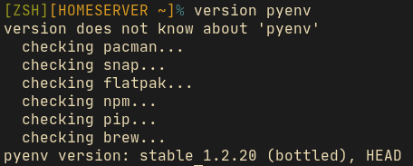

# version
What version do I have of ___?

You've been there...

```
java -v // unrecognized option
java -V // unrecognized option
java --version // unrecognized option
java --Version // unrecognized option
java -Version // unrecognized option
java -version // 1.8.0_262
```

There's no standard.

```
gcc --version
node -v
node --version
python -V
perl -v
perl --version
go version
lua -v
rustc --version
```

`version` is a simple, easily updateable script that tells you what version you are on.

```
version node   // v14.70
version gcc    // 10.1.0
version java   // 1.8.0_262
version pascal // 'pascal' does not seem to be installed.
```

## But wait, there's more!

`version` also uses the package manager on your system to find the versions of programs and libraries that it doesn't know about itself. This puts the number of items that `version` can report the version of into the thousands. This includes libraries which are not directly executable, so don't have a version flag. Examples:

```
version libxml2   // 2.9.10-2
version usbutils  // 012-2
version systemd   // 246.4-1
```

This feature currently supports the package managers: 

- `apt` (Linux - Debian, Ubuntu, and derivatives)
- `pacman` (Linux - Arch, Manjaro, and deriviatives)
- `dnf` (Linux - Fedora and derivatives)
- `snap` (Linux)
- `npm` (Mac and Linux)
- `pip` (Mac and Linux)
- `flatpak` (Linux)
- `brew` (Mac and Linux)

If `version` doesn't know about the command, it will start searching through any of the package managers that are installed and report what it finds:



Read more here: [Package Manager Integration](https://github.com/bit101/version/wiki/Package-Manager-Integration)

## Info

- Current release: v1.3.0 (177 recognized tools)

- Main dev branch: 177 recognized tools

## Installing / Uninstalling

Install:

```
cd version
sudo ./install.sh
```

Uninstall:

```
cd version
sudo ./uninstall.sh
```

Or see [Installation](https://github.com/bit101/version/wiki/Installation) for more options.

## More info in the [Wiki](https://github.com/bit101/version/wiki)

- [Installation](https://github.com/bit101/version/wiki/Installation)

- [How it Works](https://github.com/bit101/version/wiki/How-it-Works)

- [Contributing](https://github.com/bit101/version/blob/master/CONTRIBUTING.md)

- [FAQ](https://github.com/bit101/version/wiki/FAQ)
